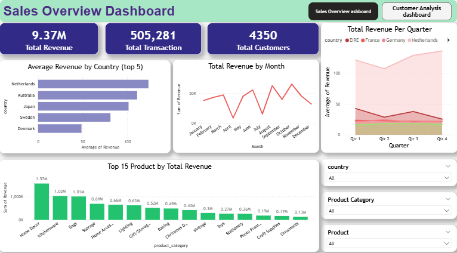
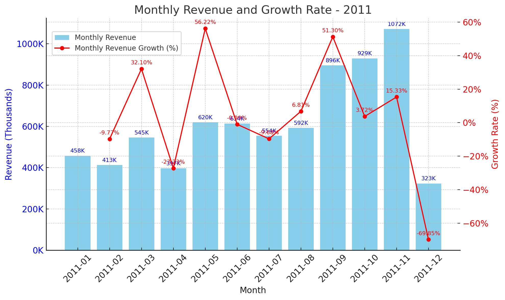

# 🧭 Pengantar

Project ini di buat untuk mengeksplorasi dataset Online Retail Sales yang didapatkan dari web Kaggle [Online Retail Sales](https://www.kaggle.com/datasets/thedevastator/online-retail-sales-and-customer-data). Dataset ini berisi transaksi penjualan dari sebuah dataset retail online selama periode tertentu khususnya dataset ini mencakup data di tahun (**2010 sampai 2011**). Informasi yang tersedia mencakup detail seperti InvoiceNo, Product, country, Description, quantity, unitprice, customerID dan InvoiceDate.
Dalam data ini terdapat :

- 9.37 Millions of total revenue
- 505,281 of total Transaction
- 4350 of total Customer

# 📌 Background

Project ini dilatar belakangi dalam proses pembelajaran statistical analysis dan mencoba categorize order berdasarkan customerID.
Dengan melakukan analysis dataset ini, berbagai insight dapat diperoleh, seperti produk terlaris, pola pembelian pelanggan, serta potensi pelanggan yang loyal yang di filter berdasarkan negara (country), informasi ini sangat bermanfaat untuk inventory management, strategi pemasaran, maupun pengambilan keputusan bisnis yang lebih tepat sasaran. Proyek ini bertujuan untuk mengeksplorasi, memvisualisasikan dan mengidentifikasi insight penting dari data Online Retail tersebut.

#### Temukan visualisasi dan query di bawah ini :

- Power BI [Visualization](https://drive.google.com/file/d/18R_6aF57MKdH1qU_FkNEqJ4ZPDekx_tL/view?usp=sharing)
- SQL QUERY ? [query SQL](sql_query)



### Berikut ini merupakan pertanyaan yang ingin saya jawab melalui query SQL:

1. Mencari Top 5 rata-rata revenue berdasarkan negara (**Country**).
2. Mencari top Penjualan product berdasarkan country.
3. Mencari TOP 10 kategori peroduk dengan barang yang direturn (dikembalikkan) terbanyak
4. Analisis Cohort untuk mengamati perilaku pembelian pelanggan dari tahun ke tahun
5. Mencari Month over Month Growth untuk mengamati perilaku pembeli (customer)

# Tools yang saya gunakan

Saya menggunakan beberapa tools untuk menganalisa dan melakukan visualisasi data, berikut beberapa tools nya :

- **SQL:** Saya gunakan untuk melakukan analysis mulai dari identifikasi produk, statistical analysis, dan melakukan ketogorisasi order.
- **PostgreSQL:** Ini merupakan DBMS yang ideal untuk handling Online-Retail-Sales data.
- **Visual Studio Code:** Ini saya gunakan sejauh ini untuk melakukan manajemen database dan sebagai pengeksekusi Query SQL.
- **Power BI:** Ini saya gunakan untuk membuat dashboard untuk menampilkan insight yang saya dapatkan.
- **Git / Github:** Ini merupakan version control dan saya gunakan untuk sharing sql scripts dana analysis projek yang saya lakukan.

### Analysis

Dari keseluruhan query untuk projek ini digunakan untuk investigasi aspek yg spesific dalam melakukan analisis data untuk Online-Retail-Sales datase.
Berikut bagaimana saya menjawab setiap pertanyaan :

### 1. Mencari Top 5 rata-rata revenue berdasarkan negara (**Country**).

Mencari Top 5 rata-rata revenue berdasarkan country atau negara.

```sql
    SELECT
    country,
    round(avg(quantity::numeric * unitprice::numeric),2) as avg_revenue
from online_retail_staging
group BY
    country
order BY
    avg_revenue desc
limit 5;
```

Berikut insight dari rata-rata revenue berdasarkan negara dalam top 5:

- 📈 Rata-rata revenue tertinggi berasal dari Netherlands dengan (**123,58**), menunjukan nilai transaksi per pesanan yang lebih besar di banding negara lain. Australia (**110,94**) dan jepang (**101,32**) memiliki rata-rata revenue yang masih kompetitif.
- 📌 Sementara Sweden (**81,04**) mulai menunjukan penurunan dengan denmark (**48,64**) memiliki rata-rata terendah dari lima besar dengan hanya 39% dari Netherlands. Pola ini menandakan adanya potensi pasar yang kuat di Netherlands, dengan Denmark sebagai pasar yang relatif kecil dari segi nilai transaksi.

  

  _Grafik menunjukkan tren rata-rata revenue tertinggi yang dipimpin oleh negara Netherlands (Belanda) dengan rata-rata revenue sebesar (**123,58**)_

### Langkah Rekomendasi

1. Prioritaskan Netherlands sebagai pasar utama
   - Tingginya rata-rata revenue (**123,58**) menunjukan potensi besar untuk meningkatkan penjualan.
   - Tingkatkan kampanye pemasaran, promosi eksklusif dan personalisasi penawaran untuk mempertahankan dan memperluas pasar.
2. Optimalkan strategi di Australia dan jepang
   - Rata-rata revenue yg masih tinggi (**110,94 & 101,32**) sehingga potensial untuk cross selling dan upselling.
   - Melakukan analisis lanjutan untuk produk terlaris di negara ini untuk memperkuat lini produk yang sudah menghasilkan revenu tertinggi.
3. Tingkatkan engangement di sweden dan denmark.
   - Dengan revenue (**81,04**) pasar ini bisa dioptimalkan melalui paket bundling atau program loyalitas untuk meningkatkan nilai transaksi per pesanan.
   - Dengan rata-rata revenue rendah (**48,64**) menunjukan perlunya strategi khusus seperti diskon minimum pembelian atau promosi free shipping agar pelanggan terdorong membeli lebih banyak dalam satu transaksi.

### 2. Mencari top 10 Penjualan berdasarkan kategori produk dan negara

Berikut breakdown insight dari top 10 penjualan berdasarkan kategori product dan negara :

- 🔑 United Kingdom mendominasi penjualan dengan kategori **Ornaments** menghasilkan revenue sebesar _168.469_ -- Jauh meninggalkan negara lainnya.
- Netherlands menempati posisi kedua dengan kategori **Lighting**, menghasilkan revenue _9.568_, terpaut sangat signifikan dari posisi pertama. dan France berada di posisi ke tiga dengan kategori yang sama yaitu **Lighting** sebesar _7.277_.
- Negara-negara seperti **Japan**, **Spain**, dan **Germany** menunjukkan fokus kategori produk yang bervariasi, mulai dari _lighting_, _Kitchenware_, hingga _gift/Storage box_.
- Terdapat pola _Cluster Kategori_ pada negara-negara eropa: beberapa negara cenderung unggul di _Lighting_, sementara negara seperti _Spain_ dan _Finland_ mendominasi di _Kitchenware_


#### 🔍 Analisis Distribusi dan Segmentasi

- **Kesenjangan Pasar:** Revenue United Kingdom lebih dari 17x lipat dibandingi posisi kedua (Netherlands), mengindikasikan pasar sangat terkonsentrasi pada satu negara dan kategori tertentu.

RUMUS :
Perbandingan = Revenue UK / Revenue Netherlands
= 168.469,60 / 9.568,48 = 17,6

- **Segmentasi kategori:** menunjukkan bahwa produk dekorasi rumah seperti _Ornaments_ dan _Lighting_ menjadi primadona di banyak negara, sedangkan kategori _Vintage_ dan _Home Accessories_ cenderung muncul pada negara dengan total revenue yang rendah.

### 3. Mencari TOP 10 kategori peroduk dengan barang yang direturn (dikembalikkan) terbanyak

Berikut breakdown insight untuk 10 kategori dengan kondisi barang terbanyak direturn atau dikembalikan :

- Kategori produk dengan paling terbanyak direturn dipimpin oleh kategori _Home Decor_ dengan jumlah barang yang dikembalikan sebanyakn 355 unit.
- Kitchenware menempati posisi kedua dengan sebanyak 179 unit barang yang direturn atau dikembalikan.
- Untuk posisi ketiga di tempati oleh 3 kategori produk seperti Storage (**104**), Gift/Storage Box (**102**) dan Home Accessories (**100**)
- Untuk posisi terkahir dengan barang yg direturn paling sedikit yaitu produk dengan kategori _Vintage_ dengan hanya sejumlah 74 unit barang yang direturn.


_Grafik/chart diatas memberi gambaran bahwa dari 10 kategori produk yg ditampilkan **Home Decor** menjadi kategori produk yang paling banyak direturn atau dikembalikan dengan 355 unit barang_

### 4. Analisis Cohort untuk mengamati perilaku pembelian pelanggan dari tahun ke tahun

Berikut breakdown insight untuk Analisis Cohort guna mengamatik perilaku pembelian pelanggan dari tahun ke tahun.

1. Pelanggan Cohort 2010
   - Pada tahun pertama mereka berbelanja (2010), net revenue yang dihasilkan adalah 523,431.
   - Di tahun berikutnya (2011), pelanggan cohort ini justru menghasilkan revenue yang jauh lebih besar, yaitu 3,707,137.
   - Ini menandakan adanya customer retention yang sangat baik di tahun kedua, bahkan dengan peningkatan revenue lebih dari 7x lipat dibanding tahun pertama.
2. Pelanggan Cohort 2011
   - Data menunjukkan bahwa pelanggan baru yang bergabung di 2011 langsung memberikan kontribusi besar, yaitu 3,705,854 pada tahun yang sama.
   - Tidak ada data lanjutan untuk tahun berikutnya karena dataset hanya sampai 2011.
3. Implikasi Bisnis
   - Pelanggan lama (2010) memiliki potensi nilai yang tinggi di tahun-tahun berikutnya, sehingga program loyalty atau customer relationship management layak diperkuat.
   - Pertumbuhan revenue yang tinggi dari cohort lama menunjukkan adanya kepuasan pelanggan dan relevansi produk yang konsisten.
   - Cohort baru (2011) juga memberikan kontribusi besar sejak awal, yang bisa menjadi peluang untuk repeat purchase jika dikelola dengan baik di periode selanjutnya.


_Grafik/chart di atas memberikan gambaran bahwa pelanggan cohort 2010 mengalami peningkatan net revenue yang signifikan pada tahun kedua (2011), yakni lebih dari 7x lipat dibanding tahun pertama. Sementara itu, pelanggan cohort 2011 langsung menghasilkan kontribusi net revenue yang besar di tahun yang sama mereka bergabung. Hal ini menunjukkan potensi besar dari customer retention dan peluang peningkatan pembelian ulang dari pelanggan baru._

### 5. Mencari Month over Month Revenue Growth untuk mengamati perilaku pembeli (customer)

Berikut adalah breakdown insight Analisis Month-over-Month Revenue Growth untuk mengamati perilaku pembelian pelanggan dari bulan ke bulan sepanjang tahun 2011.

- Pada bulan pertama di tahun 2011 Retail mendapatkan revenu sebesar _458K_ (cukup besar), namun pada bulan selanjutnya mengalami penurunan sejumlah **-9.7%** menjadi _413k_ pada bulan ke 2.
- Pada bulan ke 3 dan 4 mengalami fluktuasi yg cukup signifikan jauhnya dengan persentase sebesar **32.10%** untuk pertumbuhan revenue di bulan ke 3 dan **-27.23%** untuk penurunan revenue di bulan ke 4
- Pada bulan ke 5 pertumbuhan revenue meningkat cukup tajam dengan mencapai persentase **56.22%** dengan pertumbuhan revenue sebesar _620K_, kemudia bulan selanjutnya mengalami penurunan dan pertumbuhan yang relatif stabil, hingga mencapai puncak pada November. lalu mengalami penurunan drastis di bulan terakhir _desember_ sebanyak **-69.85%** dengan revenue hanya berjumlah _323K_.



_Grafik di atas memberikan gambaran bahwa pertumbuhan revenue pada tahun 2011 mengalami fluktuasi yang cukup tajam dari bulan ke bulan. Lonjakan tertinggi terjadi pada Mei dengan pertumbuhan +56,22% dibanding bulan sebelumnya, sementara penurunan terdalam terjadi pada Desember dengan -69,85%. Pola ini menunjukkan adanya periode puncak penjualan di pertengahan hingga akhir tahun, diikuti penurunan drastis menjelang akhir tahun. Hal ini mengindikasikan adanya faktor musiman atau momen tertentu yang sangat memengaruhi perilaku pembelian pelanggan._

# Conlusion

### Key Insight

1. 📈 Rata-rata revenue tertinggi berasal dari Netherlands dengan (**123,58**), menunjukan nilai transaksi per pesanan yang lebih besar di banding negara lain. Australia (**110,94**) dan jepang (**101,32**) memiliki rata-rata revenue yang masih kompetitif.
2. United Kingdom mendominasi penjualan dengan kategori **Ornaments** menghasilkan revenue sebesar _168.469_ -- Jauh meninggalkan negara lainnya.
3. 🔄 Kategori produk dengan paling terbanyak direturn dipimpin oleh kategori _Home Decor_ dengan jumlah barang yang dikembalikan sebanyakn 355 unit.
4. 🗓 Pelanggan cohort 2010 mengalami peningkatan net revenue yang signifikan pada tahun kedua (2011), yakni lebih dari 7x lipat dibanding tahun pertama. Sementara itu, pelanggan cohort 2011 langsung menghasilkan kontribusi net revenue yang besar di tahun yang sama mereka bergabung. Hal ini menunjukkan potensi besar dari customer retention dan peluang peningkatan pembelian ulang dari pelanggan baru.
5. 📊 Pertumbuhan revenue tahun 2011 menunjukkan fluktuasi tajam dari bulan ke bulan, dengan lonjakan tertinggi pada Mei (+56,22%) dan penurunan terdalam pada Desember (-69,85%). Pola ini mengindikasikan adanya faktor musiman atau momen tertentu yang memengaruhi perilaku pembelian pelanggan.

# Closing Though

Proyek ini menganalisis data penjualan online retail menggunakan SQL dan visualisasi Python dan Power BI untuk menemukan tren penjualan, kategori produk terlaris, tingkat pengembalian barang, serta pola pembelian pelanggan. Hasil analisis memberikan wawasan yang dapat digunakan untuk pengambilan keputusan bisnis dan strategi penjualan yang lebih efektif.
